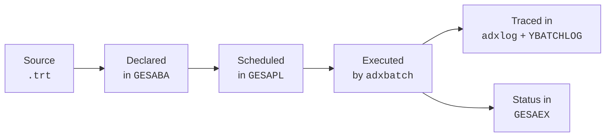

# Batch processing and scheduling

How to write batches that run at scale, and how to schedule them through the X3 batch infrastructure (`GESABA`, `GESAPL`). Covers the per-row transaction discipline, recurrent vs one-shot scheduling, dependencies, and post-mortem traces.

For performance tuning of the batch body itself (indexes, transaction granularity, profiling), see `performance.md`. For email summaries / notifications at the end of a batch, see `workflow-email.md`.

## The batch lifecycle in X3



Three objects to wire:

| Object | Form | Role |
|--------|------|------|
| Batch task | `GESABA` | Declares the script + parameters + activity code |
| Schedule | `GESAPL` | Defines when (one-shot, recurrent, calendar-driven) |
| Server | `GESBSV` | The OS process running the queue (one or several) |

Each batch runs as a fresh X3 session bound to a folder, a user (the "batch user"), and an activity code. The session has no UI — `Infbox` / `Errbox` will hang or surface to log.

## Writing a batch script — house style

Batches live in `<folder>/TRT/Y<NAME>.trt`. Conventional structure:

```l4g
##############################################################
# YBATCH_CLOSEORDERS — close orders older than 180 days
# Parameters (passed in via GESABA):
#   [V]GPARAM1 = max age in days (default 180)
##############################################################
$MAIN
Local Integer N, AGE
Local File SORDER [SOH]

# 1. Read parameters with defaults
AGE = val([V]GPARAM1)
If AGE = 0 : AGE = 180 : Endif

# 2. Log start
Call YLOG_BATCH("YBATCH_CLOSEORDERS", "START", "age=" + num$(AGE)) From YBATCHLOG

# 3. Body — per-row transaction (see performance.md for the rationale)
N = 0
For [SOH] Where SOHSTA = 1 And ORDDAT < date$ - AGE Order By Key SOHNUM0
    Trbegin [SOH]
    Readlock [SOH]SOHNUM0 = [F:SOH]SOHNUM
    If fstat : Rollback : Continue : Endif
    [F:SOH]SOHSTA = 9
    Rewrite [SOH]
    If fstat : Rollback : Continue : Endif
    Commit
    Incr N
Next

# 4. Log end with metrics
Call YLOG_BATCH("YBATCH_CLOSEORDERS", "END", "closed=" + num$(N)) From YBATCHLOG
Return
```

Discipline:

- **`$MAIN` entry point** — `GESABA` calls the label `$MAIN` by default. Keep one per file.
- **Read parameters at the top** — `[V]GPARAM1` / `[V]GPARAM2` … are populated by the engine from the `GESABA` parameter grid.
- **Log start and end** to a custom `YBATCHLOG` table — `adxlog.log` rotates and is unsearchable.
- **Per-row or bounded-batch transactions** — never hold a `Trbegin` across the entire iteration (deadlock risk; see `performance.md`).
- **No `Infbox` / `Errbox`** — there's no user; replace with traces and a final email summary.

## Declaring the batch in `GESABA`

Path: **Administration → Settings → Batch server → Batch tasks**.

| Field | Value |
|-------|-------|
| Code | `YBATCHCLOSE` (the task code, used by the schedule) |
| Description | Human-readable, appears in monitoring views |
| Module | Activity code (e.g. `YOPS`) |
| Type | `Treatment` for a `.trt`, `Subprogram` for a callable `Subprog` |
| Script | `YBATCH_CLOSEORDERS.trt` (without extension on some patches) |
| User | The X3 user the batch runs as (sets ACL scope) |
| Folder | Bind to one folder, or leave blank for the active one |

Then the parameter grid:

| Rank | Code | Type | Default | Description |
|------|------|------|---------|-------------|
| 1 | `AGE` | Integer | `180` | Max age in days |
| 2 | `DRY` | Char(1) | `N` | `Y` = report only, no write |

Parameters surface in L4G as `[V]GPARAM1`, `[V]GPARAM2`. The engine doesn't enforce types — your script reads them as strings and converts.

## Scheduling in `GESAPL`

Path: **Administration → Settings → Batch server → Recurring tasks** (or "Pending tasks" for one-shots).

| Field | Value |
|-------|-------|
| Code | `YPLNCLOSE` (schedule code) |
| Task | The `GESABA` code (`YBATCHCLOSE`) |
| Recurrent | `Yes` for repeating jobs |
| Calendar | Standard calendar from `GESACR`, defines run days |
| Start time | First fire (for recurrent: the first occurrence) |
| Interval | E.g. `1 day`, `1 hour`, `15 minutes` |
| End date | Optional cap |
| Server | Which `GESBSV` server picks it up |

### Recurrent vs polling — pick the schedule, not the loop

```l4g
# Anti-pattern: polling loop in a batch body
While 1
    For [YINBOX] Where ...
        # process new rows
    Next
    Sleep 30
Wend
```

This holds a session open forever, leaks resources on crash, and survives nothing. Instead, write the body to do **one pass** and schedule it recurrent every 30 seconds — the engine handles restart, monitoring, and crash recovery.

### Calendar-driven schedules

For business-hour-only or end-of-month jobs, define a calendar in `GESACR` with the relevant working days, and reference it. The engine picks the next valid slot.

### One-shot jobs

For ad-hoc runs (data migration, one-time fix), use **Pending tasks** instead of recurrent. Set the task and time, the engine deletes the schedule after a successful run.

## Running multiple servers (`GESBSV`)

For load distribution, declare more than one batch server. Each server runs as an OS process, picks tasks from the queue, and reports back. Tasks are not pinned to a server unless the schedule names one — the queue distributes.

| Setting | Effect |
|---------|--------|
| Server name | OS host or virtual queue name |
| Max concurrent | Number of tasks the server runs in parallel |
| Folder | Restrict to a folder, or leave open |

Sizing rule: max concurrent × heavy-task RAM ≤ server RAM, with a margin. Heavy batches (mass updates, MRP runs) on their own server keeps OLTP responsive.

## Job dependencies — chain batches

X3's native scheduler does not support DAG dependencies directly (no "run B after A succeeds"). Two patterns:

### Option 1 — chain in script

```l4g
$MAIN
# Run task A
Call MAIN_A() From YBATCH_A
If [S]stat1
    # A failed — log and stop, do not run B
    Call ECRAN_TRACE("A failed, skipping B", 2) From GESECRAN
    End 1
Endif
# Run task B
Call MAIN_B() From YBATCH_B
End 0
```

Cohesive, atomic — but the parent runs as one batch. If B is heavy, schedule it independently.

### Option 2 — A enqueues B

```l4g
$MAIN
# A's body
…
# Enqueue B at the end
Call CRBATCH("YBATCHB", date$, time$ + 60, "") From GESBAT
Return
```

`CRBATCH` (or your folder's signature for "create pending batch") enqueues the dependent task. Decoupled, but error path — if A succeeded but B fails to enqueue — needs explicit handling.

## Monitoring — the `GESALI` and `GESAEX` queues

| Form | What it shows |
|------|---------------|
| `GESALI` | Pending / queued tasks (not yet started) |
| `GESAEX` | Currently running and completed tasks with status |
| `GESACR` | Calendars |

Status codes (in `GESAEX`):

| Code | Meaning |
|------|---------|
| `0` | Pending |
| `1` | Running |
| `2` | Completed OK |
| `3` | Aborted |
| `4` | Error |

A batch that ends with non-zero `[S]stat1` records as `4` (error) and stops the recurrent schedule until acknowledged in some configurations. Check the monitoring queue daily, or scrape `GESAEX` from a custom dashboard.

## Custom batch log table — pattern

Per-batch tracing is essential because `adxlog.log` rotates and is hard to search. Pattern:

```l4g
##############################################################
# YBATCHLOG — central batch log
##############################################################
Subprog YLOG_BATCH(JOB, EVENT, DETAIL)
Value Char JOB(), EVENT(), DETAIL()

Local File YBATCHLOG [YBL]
Raz [F:YBL]
[F:YBL]JOB    = JOB
[F:YBL]LOGDAT = date$
[F:YBL]LOGTIM = time$
[F:YBL]EVENT  = EVENT          # "START", "END", "ERROR", "STEP"
[F:YBL]DETAIL = left$(DETAIL, 500)
[F:YBL]LOGUSER = [V]GUSER
Write [YBL]
End
```

Schema for `YBATCHLOG` (declared in `GESATB`):

| Column | Type | Note |
|--------|------|------|
| JOB | Char(20) | Batch code from `GESABA` |
| LOGDAT | Date | |
| LOGTIM | Time | |
| EVENT | Char(10) | `START`, `END`, `STEP`, `ERROR` |
| DETAIL | Char(500) | Free text (metric, error message, parameters) |
| LOGUSER | Char(10) | `[V]GUSER` |

Index on `(JOB, LOGDAT, LOGTIM)` — search "all runs of YBATCHCLOSE last week" must be cheap.

## Post-batch summaries — email and metrics

Pattern for end-of-day batches:

```l4g
$MAIN
…body…

# At the end:
Local Char SUBJECT(100), BODY(8000)
SUBJECT = "[X3] " + JOB - " — " + num$(N) + " rows processed"
BODY = "Job: " - JOB + chr$(13) + chr$(10) +
       "Started: " - num$([L]START_DAT, "J/M/A") - " " - num$([L]START_TIM, "H:M:S") + chr$(13) + chr$(10) +
       "Duration: " - num$([L]ELAPSED) - " s" + chr$(13) + chr$(10) +
       "Rows: " - num$(N) + chr$(13) + chr$(10) +
       "Errors: " - num$(NERR)

Call ENVMAIL("ops@example.com", "", "", SUBJECT, BODY, "", "") From AMAIL
```

See `workflow-email.md` for the full `ENVMAIL` signature and HTML body variant, and `common-patterns-v12.md` recipe 5 for a complete orphan-orders batch with email.

## Sleep and pacing — be a good neighbor

Long-running batches that touch hot tables should pace themselves:

```l4g
For [SOH] Where SOHSTA = 1 Order By Key SOHNUM0
    Trbegin [SOH]
    # … per-row work …
    Commit
    If mod(N, 100) = 0 : Sleep 1 : Endif      # 1-second pause every 100 rows
Next
```

`Sleep` accepts an integer in seconds. For sub-second pauses, use `Sleep$ "0.1"` if available on your patch level, otherwise wrap in `System "sleep 0.1"`.

Pacing matters less for off-hours runs, more for batches scheduled during business hours.

## Restart safety — assume crashes

A batch can crash mid-iteration (server restart, network glitch, DB hiccup). Design for resumability:

- **Mark progress on the row, not in a counter.** If the job advances `[F:SOH]SOHSTA = 9`, the next run skips already-processed rows naturally.
- **Use idempotency keys** for cross-system effects (don't double-send an email or double-charge an account).
- **Persist intermediate state** before risky steps. A batch that holds 10,000 rows in memory and crashes loses everything — chunk and commit.

## Common batch anti-patterns

| Anti-pattern | Fix |
|--------------|-----|
| Polling loop with `While 1 + Sleep` | Use a recurrent schedule |
| Single big `Trbegin` around the whole `For` | Per-row or bounded-batch transactions (`performance.md`) |
| Hardcoded folder name in the script | Use `[V]GFOLDER` |
| `Infbox` / `Errbox` for status | Use traces + email summary |
| Reading `[V]GPARAM1` without a default | Always: `If P1 = "" : P1 = "default" : Endif` |
| Unbounded `For` over a growing table | Add `Where ROWLOG > [L]LAST_RUN` to limit scope |
| No log on success | Log start AND end — without it you can't prove the batch ran |
| Skipping error path | Every `If fstat` writes a trace and continues or stops deliberately |

## Review checklist for batches

1. `$MAIN` entry, parameters read with defaults at top?
2. Body uses per-row or bounded-batch transactions (no `Trbegin` around the loop)?
3. `YBATCHLOG` entry on START + END + each ERROR?
4. No `Infbox` / `Errbox`?
5. ACL scope respected — batch user has rights to all touched tables?
6. Idempotent (re-running doesn't duplicate effects)?
7. Schedule in `GESAPL` — recurrent or one-shot, calendar where needed?
8. Email summary or status table at end?

See also: `performance.md` (transaction granularity, indexes, profiling), `workflow-email.md` (`ENVMAIL`, HTML, attachments), `debugging-traces.md` (`adxlog`, supervisor tracing), `code-review-checklist.md` (overall review pass), `security-permissions.md` (batch user ACL).
