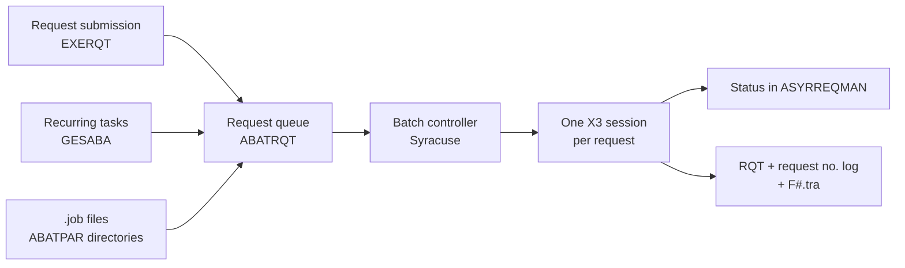

# Batch processing and scheduling

How Sage X3 V12 runs background work: batch tasks (GESABT), recurring tasks (GESABA), the batch
calendar (GESABC), request submission and monitoring (EXERQT, ASYRREQMAN), the Syracuse batch
controller, and how to write a batch process that receives parameters, logs, survives restarts and
commits row by row. Read this before scheduling anything or writing a long-running process.

## Contents
- [Architecture](#architecture)
- [Functions](#functions)
- [Defining a task (GESABT)](#defining-a-task-gesabt)
- [Writing the batch process](#writing-the-batch-process)
- [Scheduling (GESABA, GESABC)](#scheduling-gesaba-gesabc)
- [Batch controller (Syracuse)](#batch-controller-syracuse)
- [Monitoring and logs](#monitoring-and-logs)
- [Restart safety and pacing](#restart-safety-and-pacing)
- [Gotchas](#gotchas)
- [Sources](#sources)

## Architecture


```mermaid
flowchart LR
    sub["Request submission<br/>EXERQT"] --> q["Request queue<br/>ABATRQT"]
    rec["Recurring tasks<br/>GESABA"] --> q
    job[".job files<br/>ABATPAR directories"] --> q
    q --> ctl["Batch controller<br/>Syracuse"]
    ctl --> run["One X3 session<br/>per request"]
    run --> st["Status in ASYRREQMAN"]
    run --> log["RQT + request no. log<br/>+ F#.tra"]
```

Each request runs in its own classic X3 session (Sage support blog) under the folder and user it was
submitted with, and waits in ABATRQT until the controller has a free slot (Maximum active queries).

## Functions

| Code | Function | Use |
|---|---|---|
| GESABT | Task management | Declare a task (process, report or OS script) |
| GESABA | Recurring task management | Run a task or group on a schedule |
| GESABC | Batch server calendar | Non-working periods excluded from schedules (supervisor folder, common to all folders) |
| EXERQT | Request submission | Submit a task/group for a date and time, enter its parameters |
| ASYRREQMAN | Query management | List, interrupt, relaunch, purge requests; open logs |
| ABATPAR | Batch server parameters | Directories for request files (`.job`, `.mod`, `.sta`, `.run`, `.req`, `.kil`, `.old`) |
| GESACT / GESAFC | Actions / Functions | The action (template Standard process, **Batch** box) and function a task points to |
| LECTRACE | Log reading | Read `F#.tra` logs |

`GESAPL`, `GESBSV`, `GESALI`, `GESAEX` do not exist; there is no `CRBATCH From GESBAT` API.

## Defining a task (GESABT)

| Field | Meaning |
|---|---|
| Task type (TYPTAC) | X3 process or OS script (shell / command file) |
| Function (FONCTION) / Script (TRAIT) | Function to run (context and access rights) or, without function, a process/script name; PARAM = the function's `#` parameter |
| Time-out (TIMOUT) | Minutes before the server kills the task (0 = none; checked only at the server's interval) |
| Allowable delay (RETARD) | Minutes after the planned start beyond which the request is "out of time" |
| Authorization level (NIVEAU), Hourly constraints (HOR) | Who may launch it; when direct submissions may run |
| Multi-folder (MULTIDOS), Single-user (MONO) | Launch in another folder; require exclusive use of the folder |
| Message - user (MESSAGE) | Warn the submitter at the end; required for End of task workflow rules |

Sage's technical appendix: a task should be defined **by a function** whose action uses the
**Standard process** template (GTRAITE) without a main window, optionally with a dialogue box; the
action's `OUVRE_BATCH` label must open the tables needed by the dialogue controls. The older posting
method is "strongly advised" against. In GESACT the action needs the **Batch** box (ABTFLG); a
deactivated task stops its recurring tasks at their next iteration.

## Writing the batch process

The Standard process template calls your script's `$ACTION` with these events:

| Phase | Actions (in order) |
|---|---|
| Submission (interactive) | `OUVRE_BATCH`, `INIT_DIA`, criteria entry, `CONT_BATCH`, parameters saved |
| Run (interactive, or batch execution) | `INIT`, `AVANT_PAR`, `INIT_DIA`, `CONTROLE`, **`EXEC`**, `TERMINE`, log display, `SORTIE` |

- `GBATCH` = 1 while parameters are entered for a batch submission; `GSERVEUR` = 1 while the process
  runs on the batch server (0 = interactive).
- The criteria-window fields are stored in ABATRQT at submission and re-read in the batch phase
  (max 500 fields; a field name must not appear on two screens of the window).
- The template opens **no transaction**: commit per row yourself.
- A specific action runs before the standard one; `GPE = 1` skips the standard one.
- Status: ASYRREQMAN describes **Warning** as "finished on a non-blocking error code (GERRBATCH
  < 100)"; GESABA lists `GOK` <> 1, `GERRBATCH` < 100 and `GERREUR` <> 0 as errors that stop a
  recurring task unless **Proceed if error** is set. The full `GERRBATCH` scale is not documented.

```l4g
# YCLOSEOLD - specific script of action YCLOSEOLD (Standard process, Batch checked)
# Criteria screen YCL0 carries NBDAYS. Table YORDHEAD [YOH], index YOH0 = NUM.
$ACTION
  Case ACTION
    When "EXEC" : Call YCLOSE_EXEC([M:YCL0]NBDAYS)
  Endcase
Return

# A Subprog has its own locals; a Gosub label shares the template's (see entry-points.md)
Subprog YCLOSE_EXEC(NBDAYS)
Value Integer NBDAYS
  Local File YORDHEAD [YOH]
  Local File YORDHEAD [YOU]                       : # second cursor for updates
  Local Date     LIMDAT
  Local Integer  NBOK, NBKO
  Local Shortint TRANS_OPEN
  [L]LIMDAT = date$ - [L]NBDAYS
  # Interactive run: open a trace. In batch (GSERVEUR = 1) Sage's GES_AOE1 sample opens none and
  # writes to the request's log.
  If !GSERVEUR : Call OUVRE_TRACE("YCLOSEOLD") From LECFIC : Endif
  For [YOH]YOH0 Where STA = 1 and ORDDAT < [L]LIMDAT
    [L]TRANS_OPEN = adxlog
    If [L]TRANS_OPEN = 0 : Trbegin [YOU] : Endif
    Update [YOU] Where NUM = [F:YOH]NUM and STA = 1 With STA = 2, CLODAT = date$
    If fstat or adxuprec <> 1
      # Update fstat 1/3 already rolled back: Rollback without a transaction is error 48
      If [L]TRANS_OPEN = 0 and adxlog = 1 : Rollback : Endif
      [L]NBKO += 1
      Call ECR_TRACE("Not closed: " + [F:YOH]NUM, 1) From GESECRAN
    Else
      If [L]TRANS_OPEN = 0 : Commit : Endif
      [L]NBOK += 1
    Endif
  Next
  Call ECR_TRACE(num$([L]NBOK) - "closed," - num$([L]NBKO) - "skipped", 0) From GESECRAN
  If !GSERVEUR : Call FERME_TRACE From LECFIC : Endif
End
```

The `STA = 1` test inside the `Update` makes a rerun harmless: rows already closed are not touched.
Trace calls (`OUVRE_TRACE`, `ECR_TRACE`, `FERME_TRACE`) are partly community-reported — see
`debugging-traces.md`. The `If !GSERVEUR` guard comes from Sage's silent-import sample (GES_AOE1), which
closes the trace with `Call CLOSE_LOC From LECFIC` instead of `FERME_TRACE`. Never use
`Errbox`/`Infbox`/`LEC_TRACE` in the EXEC of a batch run: there is no user.

## Scheduling (GESABA, GESABC)

| Field | Meaning |
|---|---|
| Folder, User code, Password | Identity the requests run under (password needed for another user/folder) |
| Group (GRP) / Task code (TACHE) | What to launch; a group must not contain inactive tasks or subgroups |
| Periodicity (PERIO), JOUR, QUANT, FDM | Daily/weekly days/monthly days and Month end |
| Excluded days (CAL) | A GESABC calendar (up to 25 date intervals) |
| Start/End time (HDEB/HFIN) + Frequency (FRQ) | Every N minutes within the time range |
| One single query (ONE) | One request per day that sleeps FRQ minutes between runs — it occupies a slot all day |
| Purge (EPUR) | With a frequency: keep only the running and previous request in history |
| Proceed if error (CNTERR) | Keep relaunching after an error |
| Time (HEURE) ×3 + Forced execution (FORCE) | Fixed hours; Forced creates requests even if the hour has passed |
| Relative date grid | Initialise date fields of the parameter screen (base date ± N days/weeks/months, or a formula) |
| **Parameters** button | Enter the task's criteria once for all runs |

At batch-server start (or after midnight) the day's recurring requests are created. With a
frequency, only the next request exists: deleting or interrupting it stops the chain until the next
day, and a frequency change applies from the next day (menu Options / Restart restarts it).

## Batch controller (Syracuse)

In V12 the queue is driven by a **batch controller** in Syracuse (class `batchServers`; community
path Administration > Administration > Endpoints > Batch server), one per X3 solution:
Auto start; User and Role (mandatory); Time between two searches (30-60 s advised); Timeout search
time; Maximum delay to launch a query; **Maximum active queries** (whole runtime pool); Tags to pick
runtimes. Services: Start, Stop (waits for running requests), Stop all (aborts them), List of
queries. Sage support (community hub) describes it as a background thread of the Syracuse node
process that opens one classic session per request.

## Monitoring and logs

- ASYRREQMAN statuses (local menu 21): Standby, In progress, Finished, Held, Kill, Canceled, Error,
  Overdue, Warning. Actions: Log, Interrupt, Relaunch query / group, Restart recur. task, Parameter
  entry, Purge, Information (controller status); **Classic function** opens the old AREQUETE view.
- Per-request log: `RQT` + request number, in the TRA directory of SERVX3; general server log in the
  same directory (`server.tra`).
- Function logs: `F#.tra` in the folder's TRA directory (`#` from counter `[C]NUMIMP`), read with
  LECTRACE.
- E-mail the log: an **End of task** workflow rule with **Linked trace file** (`workflow-email.md`).
- Community-reported (2021 R3+): Administration > Usage > Logs > X3 session logs, type "Batch
  query", traces a given task/request at engine level.

## Restart safety and pacing

- Assume the request can be killed at any row (time-out, Interrupt, server stop): commit per row or
  per small chunk (`database.md`); a single transaction over thousands of rows can hit error 43
  ("too many locks").
- Make every write conditional on the state it changes (`Where STA = 1`), or keep a checkpoint row in
  a Y table updated in the same transaction as the work.
- Prefer a recurring task with a frequency to an endless polling loop in one request; if you must
  wait inside a run (rate-limited API), `Sleep N` pauses N seconds.
- Log counters (read, done, skipped, failed) at the end. `GERRBATCH` is the documented hook to flag
  a run that completed with rejects (Warning status) — check on your patch which value displays as
  Warning before relying on it in monitoring.

## Gotchas
- Single-user (MONO) tasks are not executed if the folder cannot switch to single-user mode;
  community-reported: they block other tasks while running.
- Hourly constraints of the task do not apply to group or recurring launches (the group's or the
  recurring task's own rules apply).
- Time-out is a minimum: the kill happens at the controller's next timeout check.
- A request planned beyond Allowable delay / Maximum delay is marked out of time and not run.
- Customisations (entry points) used by the batch server's own processing must live in the X3
  folder (community-reported).
- Recurring tasks run under the identity of the user entered in GESABA, not of whoever created them.
- Parameter values entered at submission are frozen in ABATRQT: relaunching a request reuses them.

See also: `database.md`, `debugging-traces.md`, `workflow-email.md`, `imports-exports.md`,
`performance.md`.

## Sources
- https://online-help.sagex3.com/erp/12/en-us/Content/FCT/GESABT.htm
- https://online-help.sagex3.com/erp/12/en-us/Content/FCT/GESABA.htm
- https://online-help.sagex3.com/erp/12/en-us/Content/FCT/GESABC.htm
- https://online-help.sagex3.com/erp/12/en-us/Content/FCT/ASYRREQMAN.htm
- https://online-help.sagex3.com/erp/12/en-us/Content/FCT/EXERQT.htm
- https://online-help.sagex3.com/erp/12/en-us/Content/FCT/ABATPAR.htm
- https://online-help.sagex3.com/erp/12/en-us/Content/FCT/GESACT.htm
- https://online-help.sagex3.com/erp/12/en-us/Content/FCT/LECTRACE.htm
- https://online-help.sagex3.com/erp/12/en-us/Content/MODEL/fon_traitement.htm
- https://online-help.sagex3.com/erp/12/en-us/Content/MODEL/act_traitement.htm
- https://online-help.sagex3.com/erp/12/en-us/Content/V7DEV/administration-reference_batch-server.html
- https://online-help.sagex3.com/erp/12/en-us/Content/V7DEV/4gl_sleep.html
- https://online-help.sagex3.com/erp/12/en-us/Content/V7DEV/4gl_update.html
- https://online-help.sagex3.com/erp/12/en-us/Content/V7DEV/4gl_rollback.html
- https://online-help.sagex3.com/erp/12/en-us/Content/V7DEV/4gl_call.html
- https://online-help.sagex3.com/erp/12/en-us/Content/FCT/GES_AOE1.htm (GSERVEUR guard, CLOSE_LOC)
- https://communityhub.sage.com/sage-global-solutions/sage_x3/b/sage-x3-support-insights-ame/posts/understanding-and-troubleshooting-the-sage-x3-batch-server
- https://www.greytrix.com/blogs/sagex3/2023/12/15/how-to-send-a-log-trace-file-via-email-using-the-standard-process/
