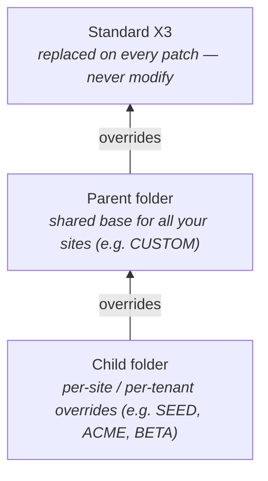

# Personalisation, activity codes, and patch delivery

How to deliver custom code that survives Sage patches, what activity codes (`GESACV`) really do, how `GESAPE` per-folder personalisation works, and the staging discipline (custom folder → parent → standard) that makes upgrades survivable.

For naming conventions (Y / Z prefixes, three-letter aliases) see `conventions-and-naming.md`. For module-level versioning of helper signatures, see `version-caveats.md`.

## The X3 customisation stack

Customisation in X3 is layered. From most stable to most volatile:



Code in a child folder overrides parent; parent overrides standard. The runtime walks this chain at script lookup time. **Custom code lives in parent or child, never in standard.**

Two complementary mechanisms control what gets activated:

- **Activity codes** (`GESACV`) — boolean flags that gate sections of dictionary or scripts. "If activity `YINT` is on, this menu entry exists, this field exists, this script gets compiled."
- **Personalisations** (`GESAPE`) — declarative changes to standard objects (a field added to a screen, a column added to a grid) without overwriting the standard `.src`.

## Activity codes (`GESACV`)

Path: **Setup → General parameters → Activity codes**.

An activity code is a 3-to-5-letter flag. Standard X3 ships hundreds (`COM` for sales, `STO` for stocks, `KFR` for French legal). Custom verticals add their own (`YINT` for integrations, `YHEALTH` for a healthcare module).

### What activity codes gate

| Object | How activity is referenced |
|--------|---------------------------|
| Field on a table | Field's `Activity` column in `GESATB` |
| Menu entry | `Activity` column in `GESAFC` (functions) |
| Screen mask block / line | Per-element activity in `GESAMK` |
| Script line | `#Active` directive (see below) |
| Workflow rule | `Activity` field in `GESAWR` |

### `#Active` in scripts

Scripts can gate compilation per-line:

```l4g
#Active YHEALTH
Local File YPATIENT [YPT]      # only compiled when YHEALTH activity is on
#End

# Standard code below — always compiled
Local File ITMMASTER [ITM]
```

Lines between `#Active <CODE>` and `#End` are stripped if the activity is off. The compiler treats the `#Active` block as conditional, so a missing custom table doesn't break compilation in folders without the activity.

Use this to deliver one codebase that handles "client A has YHEALTH, client B doesn't." For a 1-bit choice, prefer a simple `If [V]YHEALTH` runtime check; reserve `#Active` for cases where the symbol itself doesn't exist (custom tables, fields, classes).

### Patch dependency on activity codes

When delivering a patch:

1. Define the activity code in the source folder (`GESACV`).
2. Mark every custom field, function, menu entry, etc. with that activity code.
3. Validate / regenerate.
4. Export the patch.
5. On the target folder, importing the patch creates the activity code — but it's **off** by default. The site admin enables it (and validates the dictionary).

This gives you an off-switch — if a custom feature breaks production, disable the activity, regenerate, and the feature is gone without code changes.

### Activity code naming

| Prefix | Use |
|--------|-----|
| Standard X3 codes (3 letters, no Y/Z) | `STO`, `COM`, `KFR` — never reuse |
| `Y…` (vertical) | Module-wide, shipped to multiple sites |
| `Z…` (specific) | Site-specific, never reused |

Avoid generic names like `YCUSTOM` or `YMOD` — they collide between modules. Be specific: `YINTEDI`, `YHEALTHHL7`, `ZCLIENTABC`.

## Personalisation (`GESAPE`)

Path: **Setup → Personalisation → Screens** (and similar for menus, reports, workflows).

`GESAPE` lets you modify standard objects **without touching the standard source**:

| Modification type | Example |
|-------------------|---------|
| Add a custom field on a standard screen | A `YOPTYPE` field on `GESBPC` (customers) |
| Hide a standard field | Hide `BPCSAU` (account-receivable site) |
| Change field properties (length, mask, default) | Default `CUR = "EUR"` on new customers |
| Add a custom action button | `YYALIDATE` action in the toolbar of `GESBPC` |
| Reorder fields, change tab labels | Move `BPCNUM` to the top of the header |

Personalisations are per-folder. They survive patch upgrades because they don't modify standard `.src`/`.adx` — they're stored as deltas in the dictionary and re-applied by the engine on screen render.

### When to personalise vs override

| Scenario | Use |
|----------|-----|
| Add one or two custom fields to a standard screen | Personalisation (`GESAPE`) |
| Replace whole sections of business logic | Y-prefixed wrapper that calls into standard, registered as a custom action |
| Change the look-and-feel for one tenant | Personalisation, gated by activity code if needed |
| Add a whole new screen | Custom screen `ZGESBPC` (not personalisation) |

Rule of thumb: if the change is dictionary-shaped (fields, layout, default values), personalise. If it's logic-shaped (validation, calculation, integration), write Y-code in a custom folder.

### Personalisation export / import

Personalisations live in folder-specific tables. To move them between environments:

- **Patch export** in `GESAPA` (Patch generation) — select the personalisation objects.
- The export bundles them with their dependencies (activity codes, custom fields).
- **Patch import** on the target folder; validate the dictionary; the personalisations apply.

Personalisations are NOT moved by a folder copy — explicitly include them in patches.

## Folder hierarchy and overrides

The standard hierarchy:

```
X3 (or REFERENCE)         ← standard, untouched
  └── PARENT  (e.g. CUSTOM)  ← your shared customisations
        └── CHILD  (e.g. SEED)   ← per-site overrides
```

When you call a script `YBATCH_CLOSEORDERS`, the runtime looks first in `CHILD/TRT/`, then `PARENT/TRT/`, then `X3/TRT/`. The first hit wins.

To override a standard subprogram safely:

1. Copy `STDSCRIPT.src` from `X3/TRT/` to your custom folder, **renaming it** to keep the call signature the same. (X3 lookup is by name, so you keep the standard name in the custom folder.)
2. Do this only when no other option works — overriding a standard script means manually re-applying the standard's patches forever.
3. Document the override in a an `OVERRIDES` document at the root of the custom folder, listing every overridden file and the reason.

Better: write `YBATCH_CLOSEORDERS` (your own name) and call the standard from it — wraps without overriding.

## Patch delivery — the workflow

The X3 patch unit is the **dictionary patch** (`*.dat`) plus source files. Path: `GESAPA` (Setup → Usage → Folders → Patches).

### Generate a patch

1. **Select activity codes** to include — only objects flagged with these activities go in the patch.
2. **Select object types** — tables, screens, scripts, personalisations, menus.
3. **Generate** — the engine produces a `.dat` file plus a directory of source.

### Apply on target

1. **Backup** the target folder.
2. **Validate the patch** on a clone first.
3. **Import** the patch.
4. **Validate the dictionary** (`GESVAL`) — propagates the schema changes.
5. **Recompile scripts** if any changed (or let the engine do it lazily).

### Patch hygiene

- **One activity per patch when possible** — easier to roll back a single feature.
- **Number patches sequentially**, e.g. `YINT_001`, `YINT_002`. The order matters for cumulative deploys.
- **Test on staging** that mirrors production folder layout. A patch tested on a clean `SEED` folder may break on a customer's heavily-personalised one.
- **Document the dependency chain** — which patches must be applied before this one.

## Versioning your custom module

Treat your custom folder like a Git repository. Recommended layout:

```
custom-module/
├── README.md
├── CHANGELOG.md
├── activities.md        # list of YINT / Y... codes and what they enable
├── overrides.txt        # any standard scripts overridden, with reasons
├── tables/
│   └── YBATCHLOG.dict
├── trt/
│   └── YBATCH_*.trt
├── src/
│   └── Y*.src
└── patches/
    ├── 0001_initial.dat
    └── 0002_addfield.dat
```

Sync into the X3 folder structure with a deploy script — keeps source under version control without polluting the runtime layout.

## Common pitfalls

- **Modifying a standard script** — survives until the next patch, then your change is gone. Always wrap, never modify. Use `GESAPE` for dictionary changes, custom Y-script for logic. If you must override, document it in an `overrides` file at the root of the custom folder.
- **Activity code on but field not in personalisation** — the field exists in the table but isn't displayed. Check `GESAPE` for the screen.
- **Patch missing a dependency** — patch refers to a custom table that doesn't exist on target. Always include the table definition in the patch, not just the script.
- **Personalisation overriding a personalisation** — when two custom modules add a field at the same position, the second wins silently. Use distinct field positions.
- **Forgetting to validate the dictionary** after import — schema doesn't propagate, scripts compile against stale metadata.
- **Activity code typo** — `YINTE` vs `YINT` produces silent compilation skips. The line is just gone, no warning.
- **Personalisation in a child folder lost on folder rebuild** — copy the patch out before rebuilding, re-import after.

## Quick checklist before delivering a patch

1. All custom symbols Y- or Z-prefixed?
2. Every custom field, menu, action flagged with an activity code?
3. Activity code declared in `GESACV` and exported with the patch?
4. Dependent tables, fields, message chapters all included?
5. Tested on a clean clone of the target folder, not just dev?
6. Patch versioned and added to the changelog?
7. Standard scripts overridden? Documented in your `overrides` document?
8. Personalisations exported alongside the dictionary objects they reference?

See also: `conventions-and-naming.md` (Y/Z rule, three-letter aliases), `version-caveats.md` (helper signature drift between patches), `code-review-checklist.md` (Tier 2 conventions checks), `security-permissions.md` (function profiles for custom functions), `localization.md` (multi-language messages in patches).
