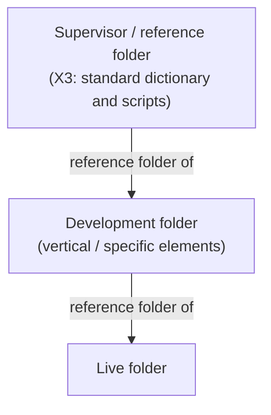

# Personalisation, activity codes and patches

How specific and vertical developments survive standard patches and version changes: where each kind of
customisation lives (Syracuse page personalisation, dictionary changes, scripts), how activity codes
protect dictionary elements, how folders inherit from each other, and how to package and integrate a
delivery with APATCH / PATCH. Read it before delivering anything from a development folder to a live one.

## Contents
- [Where a customisation lives](#where-a-customisation-lives)
- [Syracuse page personalisation](#syracuse-page-personalisation)
- [Activity codes on a delivery](#activity-codes-on-a-delivery)
- [Folder hierarchy](#folder-hierarchy)
- [Never shadow a standard script](#never-shadow-a-standard-script)
- [Creating a patch (APATCH)](#creating-a-patch-apatch)
- [Integrating a patch (PATCH)](#integrating-a-patch-patch)
- [Delivery checklist](#delivery-checklist)
- [Gotchas](#gotchas)
- [Sources](#sources)

## Where a customisation lives

| Need | V12 (classes, Syracuse) | Classic (still running in V12) |
|---|---|---|
| Change layout, labels, hidden fields | Syracuse page personalisation (variants per user / role) | Screen dictionary GESAMK: blocks and `Y_` fields with a Y activity code |
| Add a column to a standard table | GESATB: field `Y_...` with a Y activity code | same |
| Add business logic | Class script `<CLASS>_CSPE` / representation script `_RSPE` (GESACLA scripts grid) | Specific actions in `SPE<OBJ>` (GESAMK / GESAOB), entry points (GESAPE) |
| Hook into standard processing | Events and methods of the standard class, coded in its `_CSPE` script | Entry points: see `entry-points.md` |
| New entity | Y table + Y class + Y representation | Y table, screens, object |

Personalisation of **Classic pages** in Syracuse is allowed, but the help warns that reordering or hiding
fields that carry controls on a Classic page may produce unexpected results. Keep Classic control logic in
the screen dictionary and SPE scripts.

Naming of every element above: `conventions-and-naming.md`. Class scripts and events: `v12-classes.md`.

## Syracuse page personalisation

Personalisation mode (the personalisation icon on a page) lets an author reorder information, group it in
sections, tabs or columns, hide or collapse elements, change input widgets and change labels. It applies
to new pages (representation facets), Classic pages and portal pages.

- The result is a **differential structure** applied to what the application server sends. If the
  representation changes later, the personalisation still applies: new fields keep their default
  placement, deleted fields remain in the authored page.
- Several **variants** of a page can be assigned to users and/or roles; the best match is displayed and
  the user can switch. The factory variant delivered by Sage is named `SAGE`; business partners can
  deliver their own factory variants.
- These personalisations are Syracuse administration data, not X3 dictionary elements, so APATCH does not
  carry them. Move them with **Personalization management** (Syracuse administration, Utilities), which
  extracts dashboards, gadgets, menu items and personalised pages to JSON, then the Syracuse **Import tool**
  on the target repository.

## Activity codes on a delivery

What an activity code is and does: `conventions-and-naming.md`. For a delivery:

1. Create the code in GESACV: 5 characters maximum, starting with X, Y or Z (`YTKT`, `YEDI1`).
2. Put that code on **every** dictionary element of the development: tables, fields, indexes, data types,
   screens and blocks, objects, windows, actions, functions, local menus and message chapters (TXT),
   classes, properties, methods and class scripts (GESACLA), scripts (GESADC), reports.
3. Activate it in the folder record (GESADS, Specific tab) and revalidate the folder. Changing a code's
   status is done in the folder record from the parent folder, then the child folder is validated.
4. When the code is inactive, the marked elements are not generated and class scripts carrying it are not
   called: this is the switch for disabling a feature, not lines of code. There is no `#Active ... #End`
   or `$ACT` directive in the 4GL.

Some screen settings are treated as configuration and need no activity-code protection (GESAMK): the
number of lines and columns of a screen, the access code, style and control table of a field, and the
vertical / specific script names (TRTSPV / TRTSPE).

## Folder hierarchy


```mermaid
flowchart TB
    sup["Supervisor / reference folder<br/>(X3: standard dictionary and scripts)"]
    dev["Development folder<br/>(vertical / specific elements)"]
    live["Live folder"]
    sup -->|reference folder of| dev
    dev -->|reference folder of| live
```

- Each folder has a **reference folder** (GESADS field DOSREF). If a resource (script, table, report) is
  not found in the current folder, it is looked for in the reference folder.
- The supervisor folder is named X3, PAYE or GX depending on the product (GESATB). Standard scripts
  delivered by a patch are installed only in the supervisor folder, unless the target folder has the
  **Test folder** flag; the help advises deleting those copies once the test is over, and a production
  folder must not carry the flag.
- **Specific folder** flag: specific scripts present in a patch are installed in the folder even if they
  did not exist there before. Without it, only specific scripts that already exist are replaced.
- **Vertical** flag on an X/Y/Z activity code (GESADS Specific tab): used in a three-level architecture
  (reference, development, live) so that specifics defined in the intermediate folder are transferred to
  the lowest folder on revalidation or patch.

## Never shadow a standard script

Because lookup falls back to the reference folder, a script with the **same name** as a standard one in
your folder takes precedence over the standard copy. That is an override, not a customisation: it keeps
the standard name, so every later standard patch is silently bypassed. Typical failure, reported on the
Sage community: a customised p31 copy of `SUBSOHA` left in a customer folder made sales-order entry fail
after the upgrade to V12 p37, until the copy was removed (community-reported).

Use instead, in this order: class events and `_CSPE` scripts, entry points (GESAPE), `SPE<OBJ>` actions.
If an override is truly unavoidable, give it an activity code, record it in the delivery notes, and
compare it against each new standard version.

## Creating a patch (APATCH)

APATCH extracts dictionary elements and limited setup data from a folder into a patch file.

| Patch type | Use |
|---|---|
| Standard | Default; also right for most specific and vertical deliveries |
| Supervisor | Integrated only in the supervisor folder (pre-setup data such as import/export templates, workflow rules) |
| Specific | Like Standard, but patched screens lose the specific (SPE) actions not included in the patch |
| Vertical | Same as Specific for vertical (SPV) actions |
| Add-on | Keeps both SPV and SPE actions |

- **Activity codes grid**: list the X/Y/Z codes of the delivery. On integration, elements carrying a
  specific activity code that is **not** in this list are ignored. This is what keeps a standard patch
  away from specific elements, so a specific patch must list its codes. The Preloading action fills the
  objects grid with every element carrying those codes.
- **Languages grid**: dictionary texts (ATEXTE) travel as literal text in each listed language;
  specific text numbers (above 100,000) may be renumbered on integration.
- Frequent element types: `ACV` activity code, `ATB` table definition, `TAB` full table contents
  (replaces the data), a table abbreviation plus a Where condition for partial data (never deletes rows),
  `ATY` data type, `AML` local menu, `AMK` screen, `AOB` object, `AWI` window, `ACT` action, `AFC` function,
  `ADC` script description, `TRT` script source (compiled on integration), `ADX` compiled script only,
  `ASU` subprogram, `AWE` web service, `ARP` report definition, `ETA` Crystal `.rpt` file, `AWA` workflow
  rule, `AOE` import/export template, `EXE` script to run. The function orders elements by type rank so
  that, for example, data types are integrated before screens.
- File naming: `X_yyyy_zzz.dat`, where the first letter is not `P` (reserved for standard patches),
  `yyyy` is a sequence number and `zzz` the version. With underscores at positions 2 and 7, integration
  refuses to skip a number in the sequence (for example `Z_0007_150.dat` before `Z_0006_150.dat`).

An `EXE` element runs a script at the end of integration. The script must contain a subprogram named
`PATCH` that receives the folder code; tables must be opened in that folder, not the current one:

```l4g
# Script YTKTP001 - delivered as an EXE element; purges obsolete rows of a Y table
Subprog PATCH(NOMDOS)
Value Char NOMDOS()
Local File =NOMDOS + ".YTKTPARAM" [YTP]
Local Shortint TRANS_OPEN
  [L]TRANS_OPEN = adxlog
  If [L]TRANS_OPEN = 0 : Trbegin [YTP] : Endif
  Delete [YTP] Where YOBSOLETE = 2 : # local menu 1: 2 = Yes
  If fstat
    If [L]TRANS_OPEN = 0 : Rollback : Endif
    End
  Endif
  If [L]TRANS_OPEN = 0 : Commit : Endif
End
```

## Integrating a patch (PATCH)

- PATCH integrates a patch file into a list of folders. Leave **Patch integration** unchecked to run a
  simulation that only writes the log. Read the log at the end: it is stored in the log directory of the
  folder the integration was launched from.
- **Deferred validation** postpones screen and window validation to first use. The function also exists
  as the standard batch task PATCH (up to 50 folders).
- Integrating a table updates its definition, then validates it; inserting a field between two existing
  fields drops the database statistics of the whole table.
- PATCHT (Patch test) gives an impact analysis before integration; GESAPT shows the folder's patch
  history.
- Since 2019 R4, standard product updates go through the **Updates** function; PATCH remains the tool for
  add-ons and bespoke developments.

## Delivery checklist
1. Every specific element starts with the agreed letter and carries the delivery's activity code.
2. The activity code is in the APATCH Activity codes grid and the code itself (`ACV`) is in the patch.
3. Tables travel as `ATB`; data only when needed, with a Where condition rather than `TAB`.
4. Scripts travel as `TRT` (source) unless you deliberately ship compiled `ADX` only.
5. Message chapters and local menus are in the specific ranges and included as `AML` elements.
6. Syracuse personalisations are exported separately (Personalization management).
7. The patch was integrated in simulation, then on a copy of the target folder, before production.

## Gotchas
- Activity codes are 5 characters maximum: `YHEALTH`, `YINTEDI`, `ZCLIENTABC` are invalid.
- An element without an X/Y/Z activity code is treated as standard by the patch tools.
- Forgetting the Activity codes grid makes the target ignore your specific elements on integration.
- Specific fields on system or dictionary tables are lost at folder validation (GESATB).
- A partial data element never deletes rows; deletions need an `EXE` script or a `TAB` element.
- GESAPE is the entry-points function, not a "personalisation" screen; GESAPA does not exist.

See also: `conventions-and-naming.md`, `function-codes.md`, `entry-points.md`, `v12-classes.md`,
`classic-objects.md`, `database.md`.

## Sources
- https://online-help.sagex3.com/erp/12/en-us/Content/FCT/APATCH.htm
- https://online-help.sagex3.com/erp/12/en-us/Content/FCT/PATCH.htm
- https://online-help.sagex3.com/erp/12/en-us/Content/FCT/GESADS.htm
- https://online-help.sagex3.com/erp/12/en-us/Content/FCT/GESACV.htm
- https://online-help.sagex3.com/erp/12/en-us/Content/FCT/GESACLA.htm
- https://online-help.sagex3.com/erp/12/en-us/Content/FCT/GESAMK.htm
- https://online-help.sagex3.com/erp/12/en-us/Content/FCT/GESATB.htm
- https://online-help.sagex3.com/erp/12/en-us/Content/FCT/GESAPE.htm
- https://online-help.sagex3.com/erp/12/en-us/Content/V7DEV/ui-definition_personalization.html
- https://online-help.sagex3.com/erp/12/en-us/Content/V7DEV/administration-reference_personalization-management.html
- https://online-help.sagex3.com/erp/12/en-us/Content/V7DEV/administration-reference_index.html
- https://communityhub.sage.com/us/sage_x3/f/general-discussion/254832/v12p37-x3-trt-subsoha1-adx-1367-error-6-variable-non-existent-spjt (community-reported)
